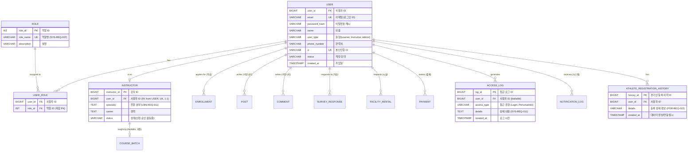

```mermaid
erDiagram
    %% --- 사용자/권한 (USR, SYS, LRN) ---
    USER {
        BIGINT user_id PK "사용자 ID"
        VARCHAR email UK "이메일 (로그인 ID)"
        VARCHAR password_hash "비밀번호 해시"
        VARCHAR name "이름"
        VARCHAR user_type "유형(Learner, Instructor, Admin)"
        VARCHAR phone_number "연락처"
        VARCHAR ci UK "본인인증 CI"
        VARCHAR status "계정 상태"
        TIMESTAMP created_at "가입일"
    }

    ROLE {
        INT role_id PK "역할 ID"
        VARCHAR role_name UK "역할명 (SYS-REQ-007)"
        VARCHAR description "설명"
    }

    USER_ROLE {
        BIGINT user_id FK "사용자 ID"
        INT role_id FK "역할 ID (복합 PK)"
    }

    INSTRUCTOR {
        BIGINT instructor_id PK "강사 ID"
        BIGINT user_id FK "사용자 ID (FK from USER, UK, 1:1)"
        TEXT specialty "전문 분야 (LRN-REQ-011)"
        TEXT career "경력"
        VARCHAR status "상태(신청,승인,활동중)"
    }

    ATHLETE_REGISTRATION_HISTORY {
        BIGINT history_id PK "경기인 등록 이력 ID"
        BIGINT user_id FK "사용자 ID"
        VARCHAR details "등록 상세 정보 (POR-REQ-015)"
        TIMESTAMP created_at "데이터 생성/연동 일시"
    }

    ACCESS_LOG {
        BIGINT log_id PK "접근 로그 ID"
        BIGINT user_id FK "사용자 ID (Nullable)"
        VARCHAR access_type "접근 유형 (Login, PersonalInfo)"
        TEXT details "상세 내용 (SYS-REQ-011)"
        TIMESTAMP created_at "로그 시간"
    }

    %% --- 관계 정의 (사용자/권한 중심) ---
    USER ||--o{ USER_ROLE : "has"
    USER ||--o| INSTRUCTOR : "is an"
    USER ||--o{ ENROLLMENT : "applies for (학습)"
    USER ||--o{ POST : "writes (커뮤니티)"
    USER ||--o{ COMMENT : "writes (커뮤니티)"
    USER ||--o{ SURVEY_RESPONSE : "responds to (학습)"
    USER ||--o{ FACILITY_RENTAL : "requests (시설)"
    USER ||--o{ PAYMENT : "makes (결제)"
    USER ||--o{ ACCESS_LOG : "generates"
    USER ||--o{ NOTIFICATION_LOG : "receives (시스템)"
    USER ||--o{ ATHLETE_REGISTRATION_HISTORY : "has"
    
    ROLE ||--o{ USER_ROLE : "assigned to"

    INSTRUCTOR ||--o| COURSE_BATCH : "taught by (Nullable, 과정)"

``` 