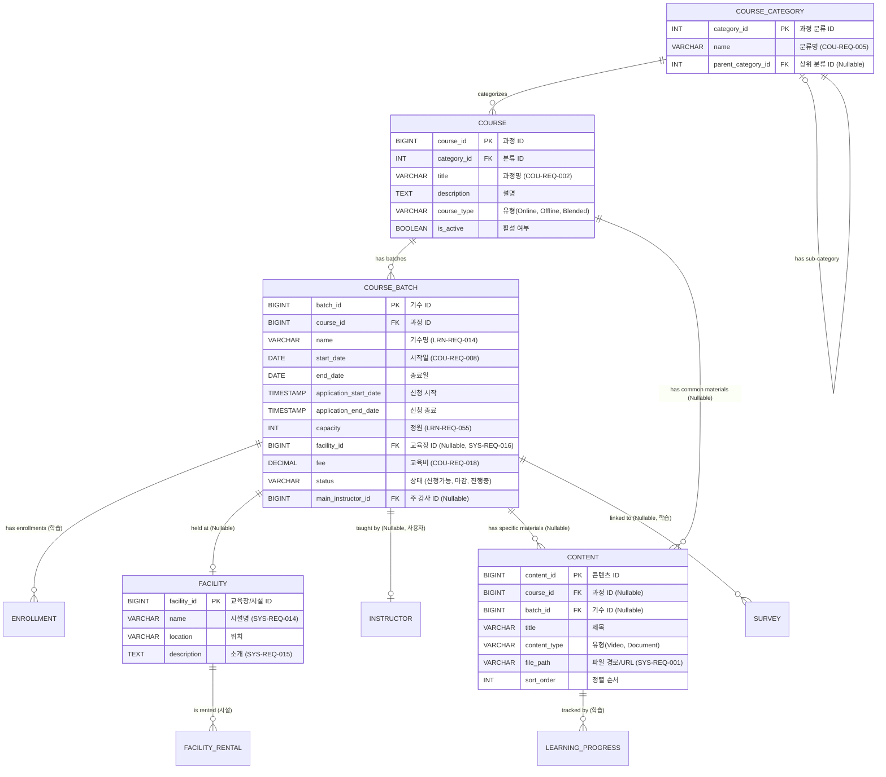

```mermaid
erDiagram
    %% --- 과정/콘텐츠 (COU, SYS) ---
    COURSE_CATEGORY {
        INT category_id PK "과정 분류 ID"
        VARCHAR name "분류명 (COU-REQ-005)"
        INT parent_category_id FK "상위 분류 ID (Nullable)"
    }

    COURSE {
        BIGINT course_id PK "과정 ID"
        INT category_id FK "분류 ID"
        VARCHAR title "과정명 (COU-REQ-002)"
        TEXT description "설명"
        VARCHAR course_type "유형(Online, Offline, Blended)"
        BOOLEAN is_active "활성 여부"
    }

    COURSE_BATCH {
        BIGINT batch_id PK "기수 ID"
        BIGINT course_id FK "과정 ID"
        VARCHAR name "기수명 (LRN-REQ-014)"
        DATE start_date "시작일 (COU-REQ-008)"
        DATE end_date "종료일"
        TIMESTAMP application_start_date "신청 시작"
        TIMESTAMP application_end_date "신청 종료"
        INT capacity "정원 (LRN-REQ-055)"
        BIGINT facility_id FK "교육장 ID (Nullable, SYS-REQ-016)"
        DECIMAL fee "교육비 (COU-REQ-018)"
        VARCHAR status "상태 (신청가능, 마감, 진행중)"
        BIGINT main_instructor_id FK "주 강사 ID (Nullable)"
    }

    CONTENT {
        BIGINT content_id PK "콘텐츠 ID"
        BIGINT course_id FK "과정 ID (Nullable)"
        BIGINT batch_id FK "기수 ID (Nullable)"
        VARCHAR title "제목"
        VARCHAR content_type "유형(Video, Document)"
        VARCHAR file_path "파일 경로/URL (SYS-REQ-001)"
        INT sort_order "정렬 순서"
    }

    FACILITY {
        BIGINT facility_id PK "교육장/시설 ID"
        VARCHAR name "시설명 (SYS-REQ-014)"
        VARCHAR location "위치"
        TEXT description "소개 (SYS-REQ-015)"
    }

    %% --- 관계 정의 (과정/콘텐츠 중심) ---
    COURSE_CATEGORY ||--o{ COURSE : "categorizes"
    COURSE_CATEGORY |o--|| COURSE_CATEGORY : "has sub-category"

    COURSE ||--o{ COURSE_BATCH : "has batches"
    COURSE ||--o{ CONTENT : "has common materials (Nullable)"

    COURSE_BATCH ||--o{ ENROLLMENT : "has enrollments (학습)"
    COURSE_BATCH ||--o| FACILITY : "held at (Nullable)"
    COURSE_BATCH ||--o| INSTRUCTOR : "taught by (Nullable, 사용자)"
    COURSE_BATCH ||--o{ CONTENT : "has specific materials (Nullable)"
    COURSE_BATCH ||--o{ SURVEY : "linked to (Nullable, 학습)"

    FACILITY ||--o{ FACILITY_RENTAL : "is rented (시설)"

    CONTENT ||--o{ LEARNING_PROGRESS : "tracked by (학습)"

``` 