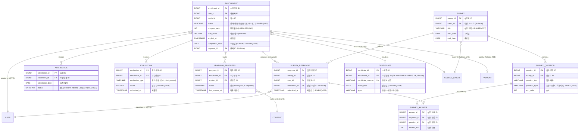

```mermaid
erDiagram
    %% --- 학습/수료 (LRN) ---
    ENROLLMENT {
        BIGINT enrollment_id PK "수강신청 ID"
        BIGINT user_id FK "사용자 ID"
        BIGINT batch_id FK "기수 ID"
        VARCHAR status "상태(신청,학습중,수료,미수료) (LRN-REQ-052)"
        INT progress_rate "진도율 (%) (LRN-REQ-063)"
        DECIMAL final_score "최종 점수 (Nullable)"
        TIMESTAMP applied_at "신청일"
        DATE completion_date "수료일 (Nullable, LRN-REQ-026)"
        BIGINT payment_id FK "결제 ID (Nullable)"
    }

    LEARNING_PROGRESS {
        BIGINT progress_id PK "학습 진도 ID"
        BIGINT enrollment_id FK "수강신청 ID"
        BIGINT content_id FK "콘텐츠 ID"
        VARCHAR status "상태(InProgress, Completed)"
        TIMESTAMP last_access_at "최종 학습일"
    }

    ATTENDANCE {
        BIGINT attendance_id PK "출결 ID"
        BIGINT enrollment_id FK "수강신청 ID"
        DATE attendance_date "출석 일자"
        VARCHAR status "상태(Present, Absent, Late) (LRN-REQ-023)"
    }

    EVALUATION {
        BIGINT evaluation_id PK "평가 결과 ID"
        BIGINT enrollment_id FK "수강신청 ID"
        VARCHAR evaluation_type "평가 종류 (Quiz, Assignment)"
        DECIMAL score "점수 (LRN-REQ-024)"
        TIMESTAMP submitted_at "제출일"
    }

    SURVEY {
        BIGINT survey_id PK "설문지 ID"
        BIGINT batch_id FK "연결 기수 ID (Nullable)"
        VARCHAR title "설문 제목 (LRN-REQ-077)"
        DATE start_date "시작일"
        DATE end_date "종료일"
    }

    SURVEY_QUESTION {
        BIGINT question_id PK "설문 문항 ID"
        BIGINT survey_id FK "설문지 ID"
        VARCHAR question_text "질문 내용"
        VARCHAR question_type "유형(주관식, 객관식) (LRN-REQ-078)"
        INT sort_order "순서"
    }

    SURVEY_RESPONSE {
        BIGINT response_id PK "설문 응답 ID"
        BIGINT survey_id FK "설문지 ID"
        BIGINT user_id FK "응답자 ID"
        BIGINT enrollment_id FK "관련 수강 ID (Nullable)"
        TIMESTAMP submitted_at "제출일 (LRN-REQ-075)"
    }

    SURVEY_ANSWER {
        BIGINT answer_id PK "설문 답변 ID"
        BIGINT response_id FK "설문 응답 ID"
        BIGINT question_id FK "설문 문항 ID"
        TEXT answer_text "답변 내용"
    }

    CERTIFICATE {
        BIGINT certificate_id PK "수료증 ID"
        BIGINT enrollment_id FK "수강신청 ID (FK from ENROLLMENT, UK, Unique)"
        VARCHAR certificate_number UK "증명서 번호"
        DATE issue_date "발급일 (LRN-REQ-069)"
        VARCHAR type "종류(수료증, 이수증)"
    }

    %% --- 관계 정의 (학습/수료 중심) ---
    ENROLLMENT }o--|| USER : "applied by (사용자)"
    ENROLLMENT }o--|| COURSE_BATCH : "is for batch (과정)"
    ENROLLMENT ||--o{ LEARNING_PROGRESS : "tracks"
    ENROLLMENT ||--o{ ATTENDANCE : "records"
    ENROLLMENT ||--o{ EVALUATION : "receives"
    ENROLLMENT ||--o| CERTIFICATE : "results in"
    ENROLLMENT ||--o| PAYMENT : "paid by (Nullable, 결제)"
    ENROLLMENT ||--o{ SURVEY_RESPONSE : "responds for (Nullable)"

    LEARNING_PROGRESS }o--|| CONTENT : "tracks content (과정)"

    SURVEY ||--o{ SURVEY_QUESTION : "contains"
    SURVEY ||--o{ SURVEY_RESPONSE : "collects"
    SURVEY }o--|| COURSE_BATCH : "linked to (Nullable, 과정)"

    SURVEY_QUESTION ||--o{ SURVEY_ANSWER : "answered by"
    SURVEY_RESPONSE ||--o{ SURVEY_ANSWER : "has"
    SURVEY_RESPONSE }o--|| USER : "submitted by (사용자)"

``` 