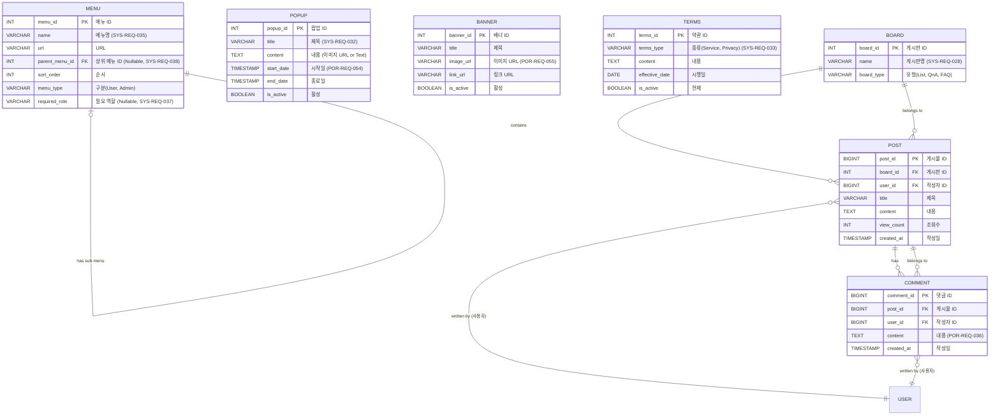

```mermaid
erDiagram
    %% --- 커뮤니티/포털 (POR, SYS) ---
    BOARD {
        INT board_id PK "게시판 ID"
        VARCHAR name "게시판명 (SYS-REQ-028)"
        VARCHAR board_type "유형(List, QnA, FAQ)"
    }

    POST {
        BIGINT post_id PK "게시물 ID"
        INT board_id FK "게시판 ID"
        BIGINT user_id FK "작성자 ID"
        VARCHAR title "제목"
        TEXT content "내용"
        INT view_count "조회수"
        TIMESTAMP created_at "작성일"
    }

    COMMENT {
        BIGINT comment_id PK "댓글 ID"
        BIGINT post_id FK "게시물 ID"
        BIGINT user_id FK "작성자 ID"
        TEXT content "내용 (POR-REQ-036)"
        TIMESTAMP created_at "작성일"
    }

    POPUP {
        INT popup_id PK "팝업 ID"
        VARCHAR title "제목 (SYS-REQ-032)"
        TEXT content "내용 (이미지 URL or Text)"
        TIMESTAMP start_date "시작일 (POR-REQ-054)"
        TIMESTAMP end_date "종료일"
        BOOLEAN is_active "활성"
    }

    BANNER {
        INT banner_id PK "배너 ID"
        VARCHAR title "제목"
        VARCHAR image_url "이미지 URL (POR-REQ-055)"
        VARCHAR link_url "링크 URL"
        BOOLEAN is_active "활성"
    }

    TERMS {
        INT terms_id PK "약관 ID"
        VARCHAR terms_type "종류(Service, Privacy) (SYS-REQ-033)"
        TEXT content "내용"
        DATE effective_date "시행일"
        BOOLEAN is_active "현재"
    }

    MENU {
        INT menu_id PK "메뉴 ID"
        VARCHAR name "메뉴명 (SYS-REQ-035)"
        VARCHAR url "URL"
        INT parent_menu_id FK "상위 메뉴 ID (Nullable, SYS-REQ-038)"
        INT sort_order "순서"
        VARCHAR menu_type "구분(User, Admin)"
        VARCHAR required_role "필요 역할 (Nullable, SYS-REQ-037)"
    }

    %% --- 관계 정의 (커뮤니티/포털 중심) ---
    BOARD ||--o{ POST : "contains"
    
    POST }o--|| BOARD : "belongs to"
    POST }o--|| USER : "written by (사용자)"
    POST ||--o{ COMMENT : "has"

    COMMENT }o--|| POST : "belongs to"
    COMMENT }o--|| USER : "written by (사용자)"
    
    MENU |o--|| MENU : "has sub-menu"

``` 