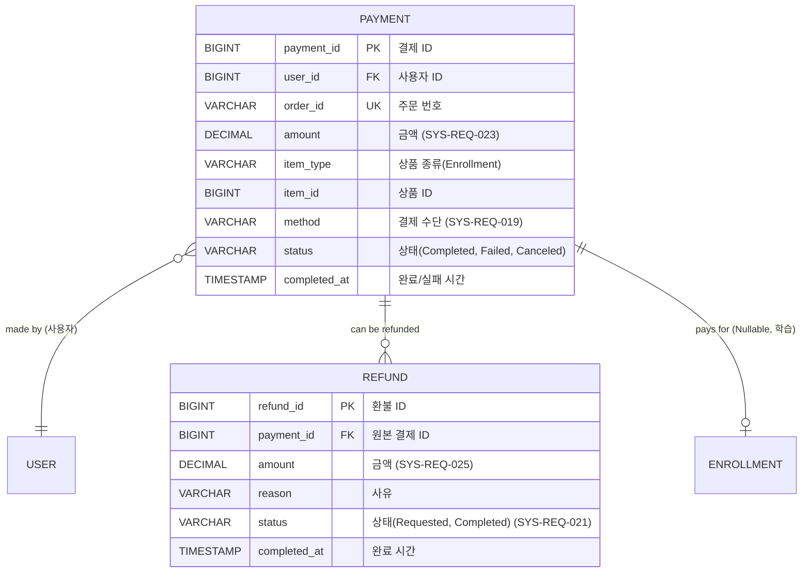

```mermaid
erDiagram
    %% --- 결제/정산 (SYS) ---
    PAYMENT {
        BIGINT payment_id PK "결제 ID"
        BIGINT user_id FK "사용자 ID"
        VARCHAR order_id UK "주문 번호"
        DECIMAL amount "금액 (SYS-REQ-023)"
        VARCHAR item_type "상품 종류(Enrollment)"
        BIGINT item_id "상품 ID"
        VARCHAR method "결제 수단 (SYS-REQ-019)"
        VARCHAR status "상태(Completed, Failed, Canceled)"
        TIMESTAMP completed_at "완료/실패 시간"
    }

    REFUND {
        BIGINT refund_id PK "환불 ID"
        BIGINT payment_id FK "원본 결제 ID"
        DECIMAL amount "금액 (SYS-REQ-025)"
        VARCHAR reason "사유"
        VARCHAR status "상태(Requested, Completed) (SYS-REQ-021)"
        TIMESTAMP completed_at "완료 시간"
    }

    %% --- 관계 정의 (결제/정산 중심) ---
    PAYMENT }o--|| USER : "made by (사용자)"
    PAYMENT ||--o{ REFUND : "can be refunded"
    PAYMENT ||--o| ENROLLMENT : "pays for (Nullable, 학습)"

``` 