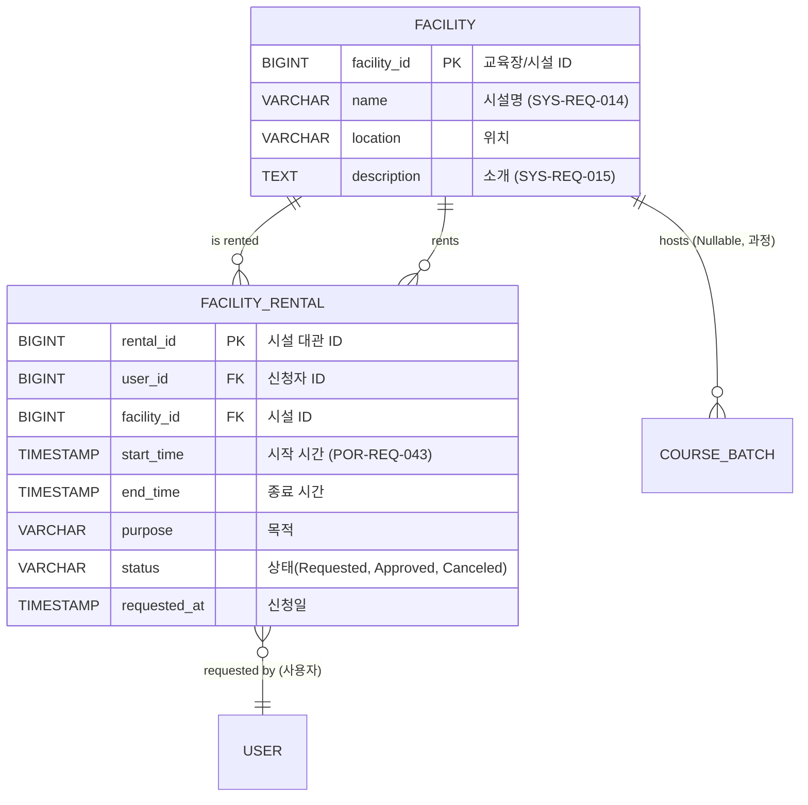

```mermaid
erDiagram
    %% --- 시설 대관 (POR, SYS) ---
    FACILITY {
        BIGINT facility_id PK "교육장/시설 ID"
        VARCHAR name "시설명 (SYS-REQ-014)"
        VARCHAR location "위치"
        TEXT description "소개 (SYS-REQ-015)"
    }

    FACILITY_RENTAL {
        BIGINT rental_id PK "시설 대관 ID"
        BIGINT user_id FK "신청자 ID"
        BIGINT facility_id FK "시설 ID"
        TIMESTAMP start_time "시작 시간 (POR-REQ-043)"
        TIMESTAMP end_time "종료 시간"
        VARCHAR purpose "목적"
        VARCHAR status "상태(Requested, Approved, Canceled)"
        TIMESTAMP requested_at "신청일"
    }

    %% --- 관계 정의 (시설 대관 중심) ---
    FACILITY ||--o{ COURSE_BATCH : "hosts (Nullable, 과정)"
    FACILITY ||--o{ FACILITY_RENTAL : "is rented"

    FACILITY_RENTAL }o--|| FACILITY : "rents"
    FACILITY_RENTAL }o--|| USER : "requested by (사용자)"

``` 