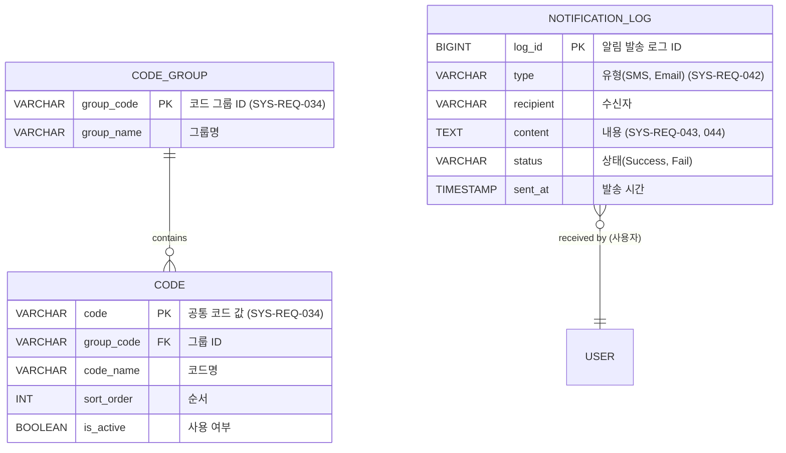

```mermaid
    erDiagram
        %% --- 시스템 공통 (SYS) ---
        CODE_GROUP {
            VARCHAR group_code PK "코드 그룹 ID (SYS-REQ-034)"
            VARCHAR group_name "그룹명"
        }

        CODE {
            VARCHAR code PK "공통 코드 값 (SYS-REQ-034)"
            VARCHAR group_code FK "그룹 ID"
            VARCHAR code_name "코드명"
            INT sort_order "순서"
            BOOLEAN is_active "사용 여부"
        }

        NOTIFICATION_LOG {
            BIGINT log_id PK "알림 발송 로그 ID"
            VARCHAR type "유형(SMS, Email) (SYS-REQ-042)"
            VARCHAR recipient "수신자"
            TEXT content "내용 (SYS-REQ-043, 044)"
            VARCHAR status "상태(Success, Fail)"
            TIMESTAMP sent_at "발송 시간"
        }

        %% --- 관계 정의 (시스템 공통 중심) ---
        CODE_GROUP ||--o{ CODE : "contains"
        
        NOTIFICATION_LOG }o--|| USER : "received by (사용자)"

``` 